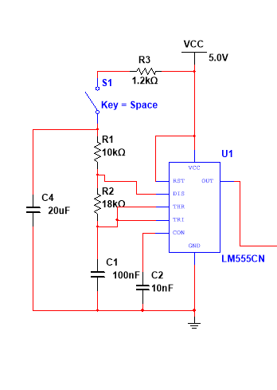
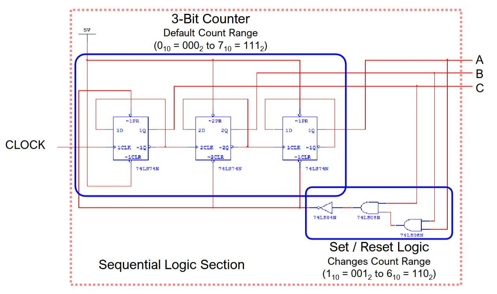
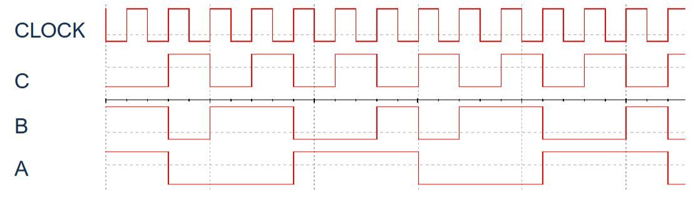
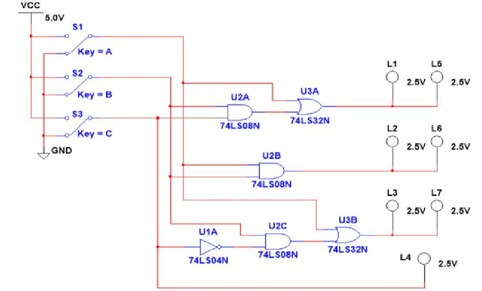
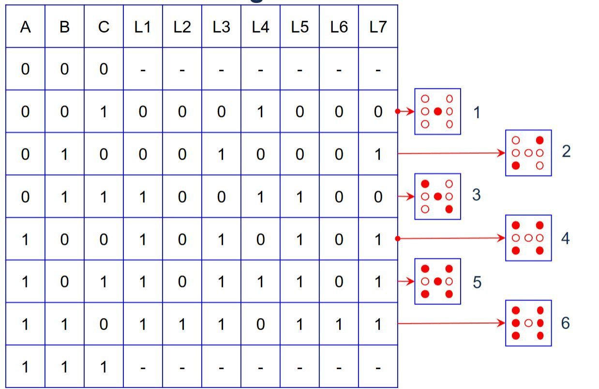
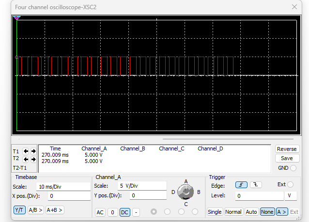
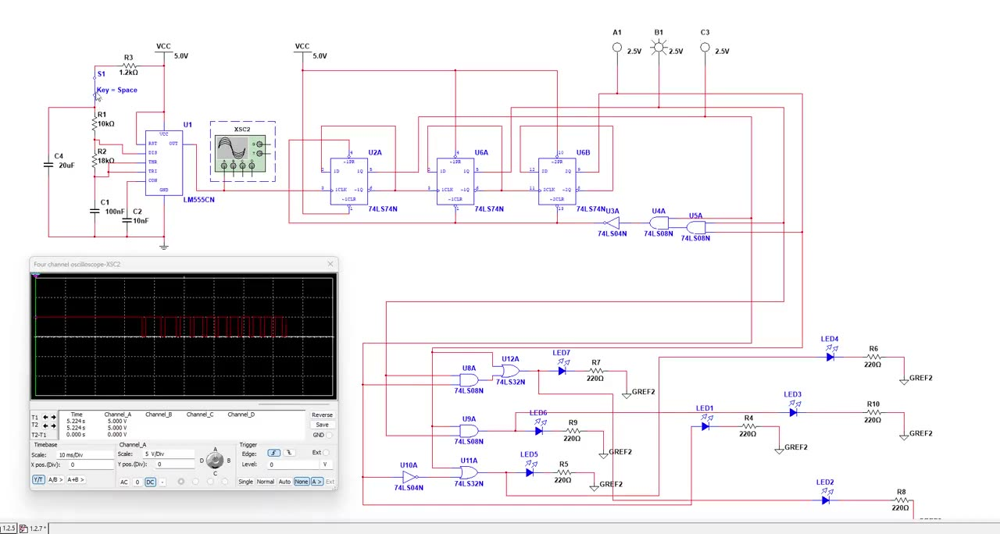

# Random Number Generator

**PLTW Digital Electronics, 2025–26** · simulated in Multisim, then soldered

## Problem
Build an electronic die from discrete logic, with no microcontroller. The project was meant to teach how analog and digital signals interact.

## Design
Three stages:

1. **Analog: 555 astable clock.** An LM555CN with R1 = 10 kΩ, R2 = 18 kΩ, and timing capacitors generates a square wave. A user switch (S1) disturbs the timing, so when you stop the clock depends on the person, not the circuit. My notebook measurement of this stage: period ≈ 14.98 ms, frequency ≈ 66.7 Hz.
2. **Sequential: 3-bit counter.** Three D flip-flops (74LS74) count continuously. Set/reset logic changes the count range from 000–111 to 001–110, so it cycles through 1 to 6.
3. **Combinational: decode.** AND, OR, and NOT gates decode the 3-bit count into a **7-LED die face** (L1–L7). The LEDs are not wired straight to the clock; they are driven through the logic.

  
  

## Truth table
Every count value mapped to the LED outputs and the die face it shows:

## Results
- Simulated the full circuit in Multisim and checked the clock output on the virtual oscilloscope.
- Soldered the circuit onto a board and confirmed it worked.

  
  

 ▶ [Simulation video (17 s)](media/rng-simulation.mp4)

Full schematic: [images/full-schematic.png](images/full-schematic.png)

## What I learned / what I'd change
I learned how analog and digital circuits work together, going from a Multisim design to a soldered build. Next time I'd make sure I fully understand how the 555 circuit works before wiring. I knew where most wires went, but the logic didn't fully click until near the end.
