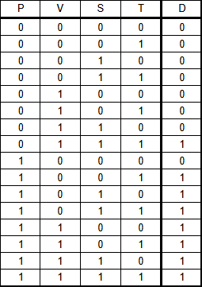
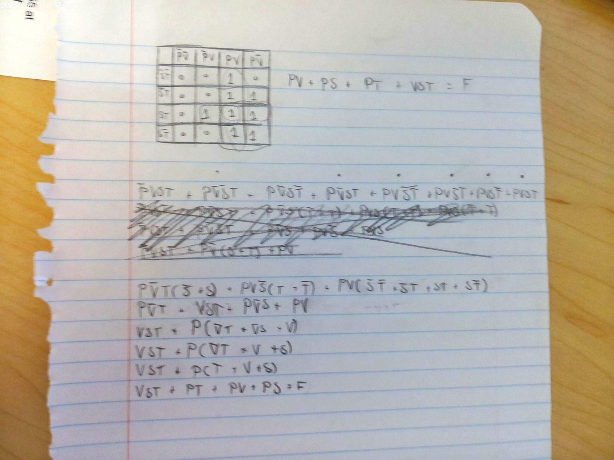
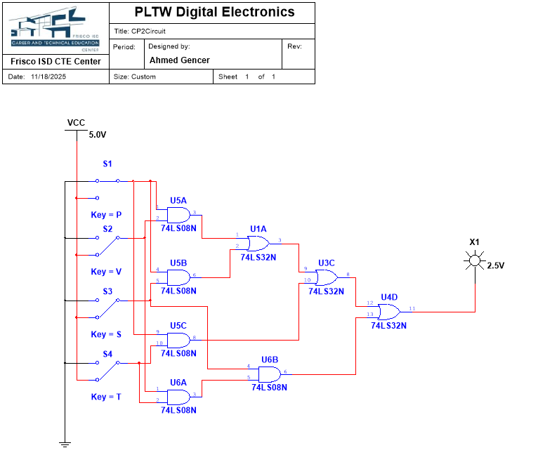
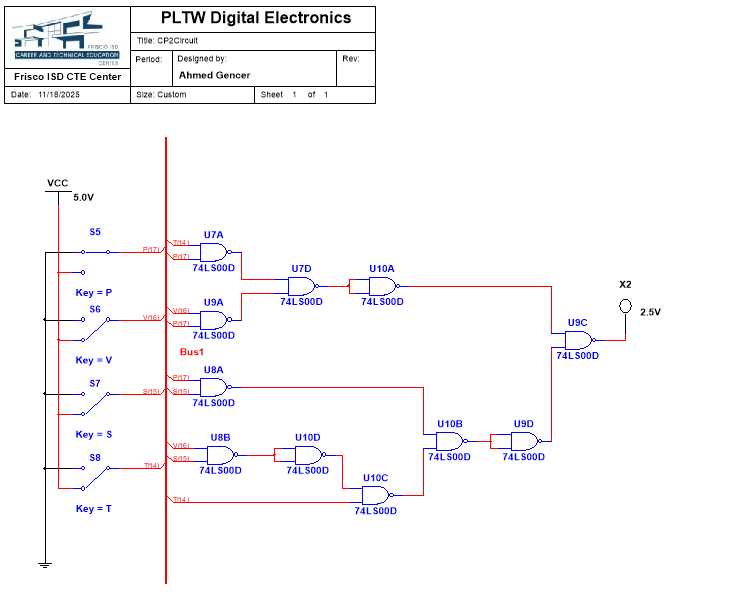
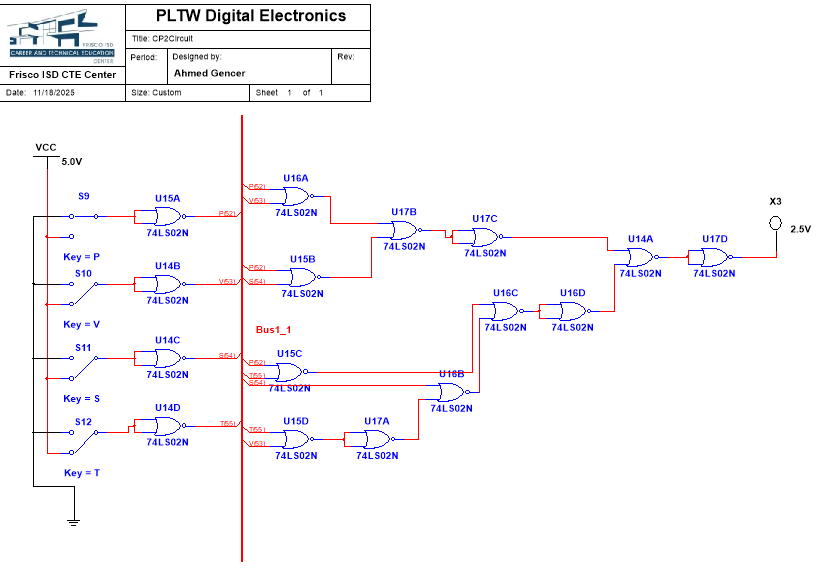

# Majority Vote

**PLTW Digital Electronics, 2025–26** · Multisim + breadboard trainer

## Problem
A four-member board votes yes (1) or no (0): **P**resident, **V**ice-president, **S**ecretary, **T**reasurer. A decision **D** passes with a majority. On a 2–2 tie, the president's vote decides. Constraint: use **only 2-input gates**.

## Design
1. Wrote the full 16-row truth table.
2. Simplified with a K-map and Boolean algebra to:

   **D = PV + PS + PT + VST**

   (The president plus any one other member passes it; or V, S, and T all vote yes.)
3. Built three versions in Multisim: simplified AOI, NAND-only, and NOR-only.
4. Compared them on gate count, IC count, cost, and delay.

  
  

| | Simplified AOI | NAND-only | NOR-only |
|---|---|---|---|
| Gate count | 8 | 11 | 16 |
| IC count | 3 | 3 | 4 |
| Cost per IC | $0.35 | $0.31 | $0.31 |
| Total cost per circuit | **$2.90** | $3.41 | $4.96 |
| Max propagation delay | **0.4 ns** | 0.6 ns | 0.7 ns |

I chose the **simplified AOI** version: it was the cheapest and had the lowest delay.

  
  
  

## Build
Breadboarded on the PLTW trainer and checked against the truth table.

## What I learned / what I'd change
Working through the logic slowly paid off, and an implementation that looks more complex can turn out cheaper. I also learned how PLDs differ from discrete logic: a PLD implements the function on one reprogrammable chip, while discrete logic wires together fixed ICs. Next time I'd keep my Multisim sheet more organized; the clutter made it hard for me, and for anyone helping me, to find the flaws in my logic.
