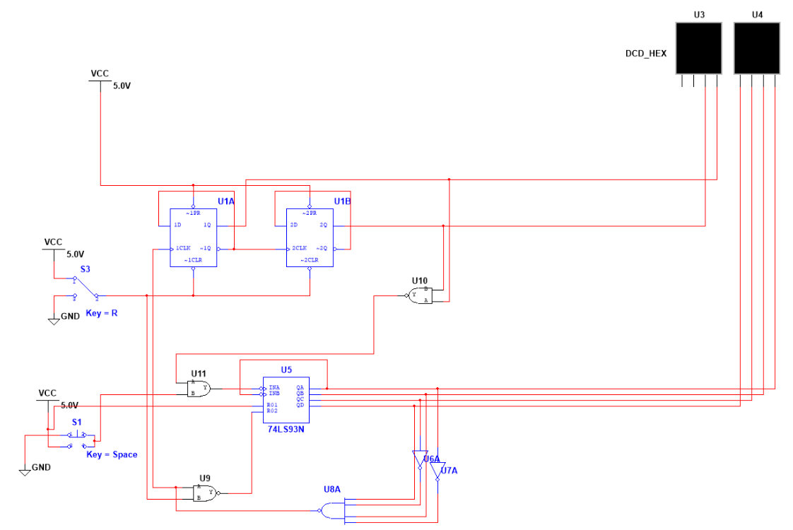

# "Now Serving" Counter (00–30)

**PLTW Digital Electronics, 2025–26** · Multisim

## Problem
A deli-counter display that counts from **00 to 30** on two seven-segment displays.
- **Next** (pushbutton): advance by one.
- **Reset** (pushbutton): return to 00.
- At **30** the count stops (a new employee takes over after the 30th customer).

## Design
- **Ones digit:** a **74LS93** 4-bit counter.
- **Tens digit:** two D flip-flops clocked from the ones stage.
- **Gating logic:** NAND/AND/inverter logic resets the ones digit at 10, carries into the tens digit, and blocks the Next input once the display reaches 30.
- **Display:** two hex displays in Multisim.

## What I learned / what I'd change
I learned how SSI (small-scale integration) counters work, how up and down counters work, and how to find a fault by placing indicator lights on intermediate wires to see where a signal stops. Next time I'd study working examples more closely, probing them the same way to trace how the signal moves.
