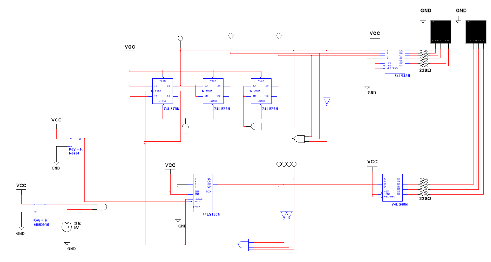

# 60-Second Timer

**PLTW Digital Electronics, 2025–26** · Multisim

## Problem
A timer that counts **00 to 59** and then rolls over to 00.
- **Clock / Suspend (S):** the clock sets the count rate (1 Hz in the spec); suspend pauses counting.
- **Reset (R):** logic 0 resets and holds the count at 00; logic 1 enables counting.

## Design
A **mod-10 counter cascaded into a mod-6 counter**:
- **Ones (mod-10):** a **74LS163** synchronous counter, cleared when it reaches 10.
- **Tens (mod-6):** three **74LS76** JK flip-flops, advanced by the ones stage and cleared at 6.
- **Display:** two **74LS48** BCD-to-seven-segment decoders driving common-cathode displays through **220 Ω** resistors.

## What I learned
How clocks and timers work, and how one counter can signal the next stage when it reaches its limit and resets itself to zero. This project built up my Multisim skills the most.
