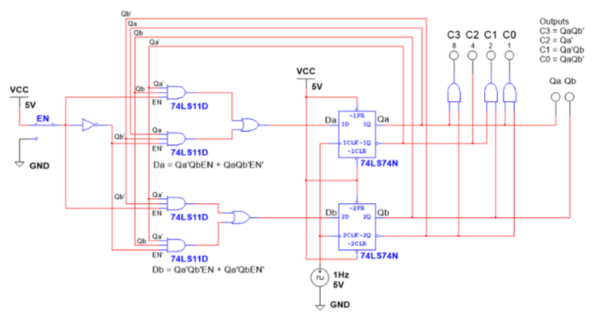

# 5-3-2 State Machine

**PLTW Digital Electronics, 2025–26** · Multisim

## Problem
Show a fixed three-digit sequence (**5, 3, 2**) on a display. Each press of a pushbutton (EN = 1) advances to the next digit; after the last digit it wraps back to the first (5, 3, 2, 5, 3, 2, ...).

## Design
- **State register:** two D flip-flops (**74LS74**), state bits Qa and Qb, on a 1 Hz clock.
- **Next-state logic:** from the state and excitation tables, using **74LS11** 3-input AND gates, OR gates, and an inverter for EN':

  ```
  Da = Qa'·Qb·EN + Qa·Qb'·EN'
  Db = Qa'·Qb'·EN + Qa'·Qb·EN'
  ```
- **Output logic:** AND gates decode the state into four outputs C3–C0, weighted 8/4/2/1 (BCD), to form each digit.



## What I learned / what I'd change
How to combine gates into a synchronous state machine, and how to keep a Multisim sheet organized. Next time I'd document the project as I go so I don't lose work after finishing.
