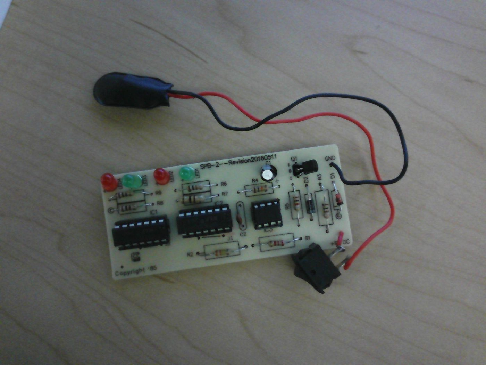
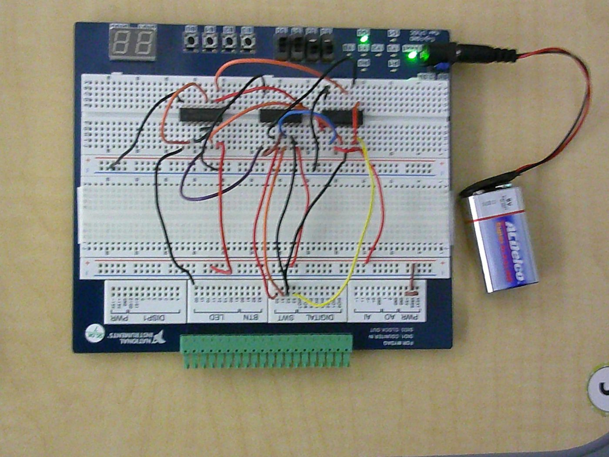
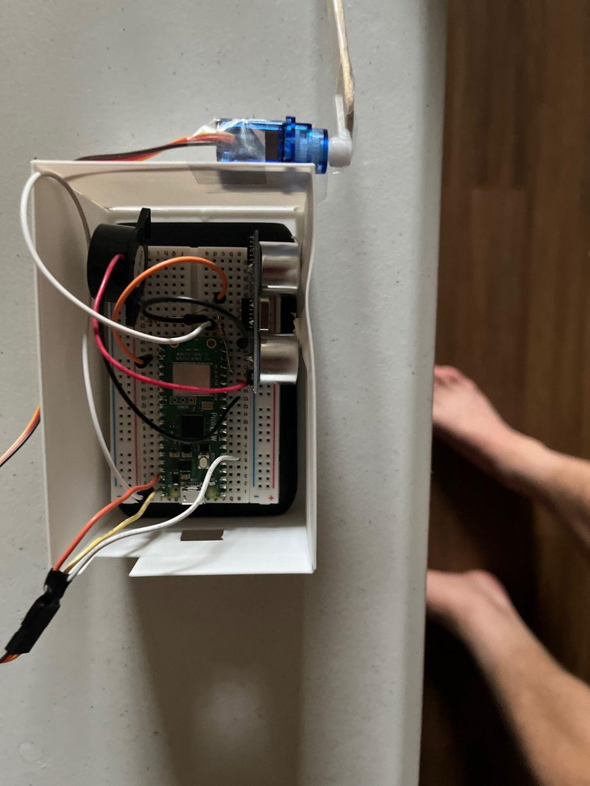

# Digital Electronics

Combinational and sequential logic projects from **PLTW Digital Electronics (2025–26)**. For each one I went from problem statement to truth table, then K-map and Boolean simplification, then a gate-level schematic in **NI Multisim**. Some were also built on a breadboard or soldered. I did every project on my own, following my teacher's instructions.

[Project page](https://ahmedg-stack.github.io/projects/digital-electronics.html)

| # | Project | Type | Key parts | Built? |
|---|---|---|---|---|
| 1 | [Random number generator](01-random-number-generator/) | 555 clock + counter + decode logic | LM555, 74LS74, AND/OR/NOT gates, LEDs | Simulated, then soldered |
| 2 | [Majority vote](02-majority-vote/) | Combinational, 4 inputs, 2-input gates only | AOI vs NAND-only vs NOR-only | Simulated + breadboarded |
| 3 | [Seven-segment decoder](03-seven-segment-decoder/) | Combinational, 3 inputs → 7 segments | Common-cathode display | Simulated + TinkerCAD |
| 4 | [Now Serving to 30](04-now-serving-to-30/) | Counter with terminal count | 74LS93, D flip-flops | Simulated |
| 5 | [60-second timer](05-sixty-second-timer/) | Mod-10 cascaded into mod-6 | 74LS163, 74LS76, 74LS48 | Simulated |
| 6 | [5-3-2 state machine](06-state-machine-5-3-2/) | Synchronous FSM | 74LS74, 74LS11 | Simulated |

**Concepts covered:** truth tables, SOP expressions, K-maps, Boolean algebra and DeMorgan's theorems, NAND/NOR universal-gate conversion, IC count and cost comparison, 555 astable clocks, D and JK flip-flops, asynchronous and synchronous counters, modulus counters, BCD-to-seven-segment decoding, and state machines.

  
  

---

## DE Capstone: Attachable Distance Sensor

A short team project: a proximity alert that can be added to older cars without built-in sensors. A **Raspberry Pi Pico 2 W** reads an **HC-SR04** ultrasonic sensor. When an object comes closer than a set threshold, the Pico sounds a piezo buzzer, turns a servo 90°, and sends an alert to a phone app over **Bluetooth Low Energy**. Closing the app ends the connection, silences the buzzer, and returns the servo to its starting position.

**Team:** Pietro Moreira (code and phone app) · Juan Salcedo (board assembly) · Haran Sudalayandi <!-- TODO: Haran's as-built role --> · me (soldering and the protective enclosure)

---

*Schematics, photos, and truth tables are from my own Multisim sheets and engineering notebook.*
